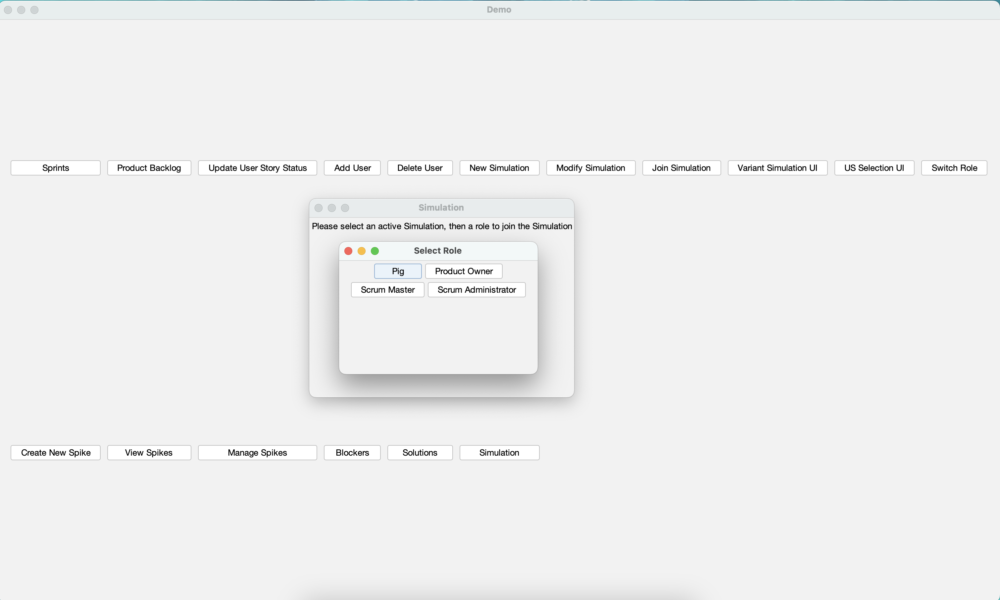

## Description 
A web app using JavaFX to build an application to manage agile project, having all CRUD function to update, delete, add item in agile project

## How to Build and Run

This project uses gradle as its build tool. Specifically, we use Gradle 8.10.1 and Java SDK 21
Therefore, you can use the `gradlew` and `gradlew.bat` executables to run gradle (depending on your platform).

### Building
To build the project, run the following gradle command in the root directory of the project:

### Windows/Command Prompt/PowerShell:
`.\gradlew.bat build`

### Mac/Linux/Git Bash/WSL:
`./gradlew build`

### Running
To run the project, run the following gradle command in the root directory of the project:  

### Windows/Command Prompt/PowerShell:
`.\gradlew.bat run`

### Mac/Linux/Git Bash/WSL:
`./gradlew run`

### Cleaning
To clean the project (remove all build artifacts), run the following gradle command in the root directory of the project:

### Windows/Command Prompt/PowerShell:
`.\gradlew.bat clean`

### Mac/Linux/Git Bash/WSL:
`./gradlew clean`
# 515
# agile-java-fx
